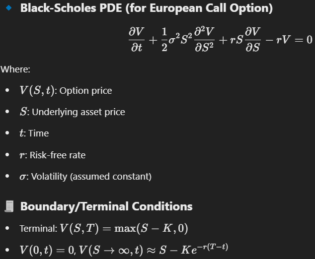
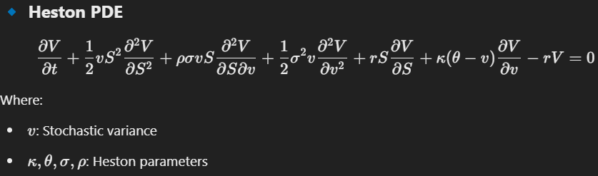
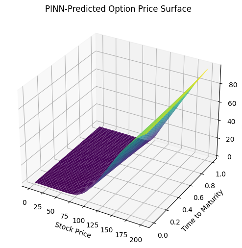
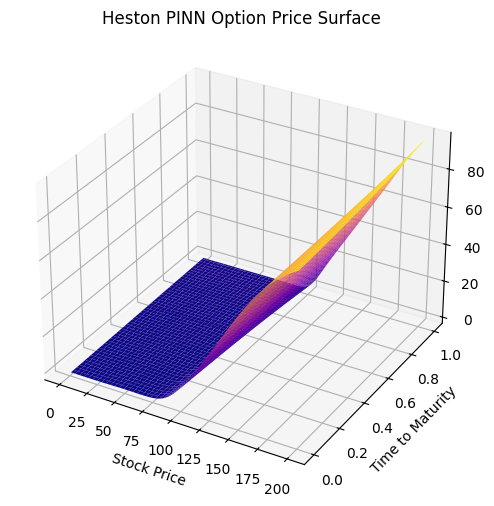

# PINN-Based Option Pricing

This project uses **Physics-Informed Neural Networks (PINNs)** to solve the **Black-Scholes** Partial Differential Equation (PDE) for pricing European options. It is then extended to the **Heston model**, which incorporates stochastic volatility—making the pricing model more realistic and applicable to real-world financial markets.

The project includes:
- PINN implementations in PyTorch for both Black-Scholes and Heston PDEs
- Saved models for direct usage
- A Streamlit web app to interactively test option prices
- Surface plots of predicted prices

---

## What are PINNs?

PINNs (Physics-Informed Neural Networks) integrate physical laws (like PDEs) into the loss function of a neural network, allowing it to learn solutions that obey known physics.

---

## Models Implemented

| Model          | Description                                  |
|----------------|----------------------------------------------|
| Black-Scholes  | Classical model with constant volatility     |
| Heston         | Advanced model with stochastic volatility    |

---

## PDE Equations used






---

## Project Structure
```bash
├── models/      # saved torch models
├── notebooks/   # two end-to-end .ipynb files for black scholes and heston model
├── results/     # visualization plots
├── src/         # python source files
├── app.py       # streamlit web-app file
└── README.md    # project documentation
```

---

## How to Run Locally

### 1. Clone the repo
```bash
git clone https://github.com/veydantkatyal/option-pricing-pinn.git
cd option-pricing-pinn
```

### 2. Install dependencies
```bash
pip install -r requirements.txt
```

### 3. Launch the Streamlit web app
```bash
streamlit run app.py
```
Then open the URL in your browser (usually `http://localhost:8501`).

---

## Web App Features

- Select between Black-Scholes and Heston models

- Adjust input parameters like stock price, time to maturity, and volatility

- Get instant option price predictions from trained models

---

## Notebooks

You can retrain the models or experiment further using the provided Colab notebooks:

- black_scholes_pinn.ipynb

- heston_pinn.ipynb

Each notebook trains a model and saves it as a .pth file in `models/`.

---

## Results

- Visual plot for black scholes model:




- Visual plot for heston model:



---

## License

This project is open-source and available under the [MIT License](https://github.com/veydantkatyal/option-pricing-pinn/blob/main/LICENSE).
